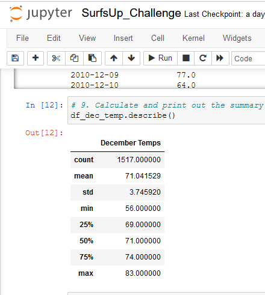

# Surfs_up Analysis
# Module 9 Challenge- _Deliverable 3_

This written analysis contains three sections:

**1. Overview of the analysis**

**2. Results**

**3. Summary**
 
## 1. Overview of the analysis

The aim of the analysis was to convince W.Avy, an investor, buy into the idea of opening a surf and ice-cream shop business in Hawaii. Through the **SQLite** database that contains the weather data for Hawaii across multiple weather stations, the analysis aims to assuage W.Avy's concerns about the risk of bad weather and rains potentially playing a spoilsport in the business. 

For the purposes of the analysis, multiple data tables were referenced in SQLite thorugh *Python* and *SQLAlchemy* to capture the appropriate data from the table and retrieve the necessary results. Then a summary table is generated to help with the decision on the next steps.

W.Avy specifically wants temperature data for the months of June and December in Oahu, in order to determine if the surf and ice cream shop business is sustainable year-round.
## 2. Results

The results from the analysis highlights the key differences in weather between June and December. The putput of the analysis for these two months are below for reference,

*a. Temperature Summary for June*


*b. Temperature Summary for December*



### **a. The Minimum temperature between the two months is significantly different:**

It is clear from the images above that the minimum temperature in December is **significantly** less than June *(56 deg F vs 64 deg F).* Thus, December maynot be the ideal time for surfing or having ice-cream in Oahu. Thus W.Avy should expect a downturn in business in December compared to June.

### **b. The Mean temperature in December is almost 4 deg F less than June:**

From the images above the mean temperature in December is **71 deg F** while the mean temperature in June is **almost 75 deg F**. Thus December is expected to be colder than June on an average which might see fewer people opting for ice-cream and surfing in the winter.

### **b. The count of data-points in December is significantly less than June:**

Upon reviewing the image above, it is clear that while June has **1,700** data-points on temperature, December has only **1,517** recordings. Thus there could be some additional work needed to identify the gaps in the December data to make the comparisons between the two months more appropriate.
## 3. Summary
### a. High-level summary of results:

The results above clearly suggests that December will potentially be more colder than June. This could mean less ideal time to surf or have ice-cream in December compared to June. Thus the revenue or sales in December is expected to be less tha June so W.Avy needs to take that into account while making the decision.

### b. Two additional queries to gather more data for June & December:
####  Compare precipitation value in June and December:

Similar to reviewing the temperature, W.Avy could also compare precipitation data in June and December to understand if any of these months have significant rainfall which could affect sales in the ic-cream and surf shop. The code to pull the precipitation data is as follows:

```
## June Precipitation- Query 1
june_prcp = []
june_prcp = session.query(Measurement.date, Measurement.prcp)
june_temp = session.query(Measurement.date, Measurement.prcp).filter(extract('month',Measurement.date) == '6').all()
df_june_prcp = pd.DataFrame(june_prcp, columns=['date','June Prcp'])
df_june_prcp.set_index(df_june_prcp['date'], inplace=True)
df_june_prcp = df_june_prcp.sort_index()
df_june_prcp.describe()

## December Precipitation- Query 2
dec_prcp = []
dec_prcp = session.query(Measurement.date, Measurement.prcp)
dec_prcp = session.query(Measurement.date, Measurement.prcp).filter(extract('month',Measurement.date) == '12').all()
df_dec_prcp = pd.DataFrame(dec_prcp, columns=['date','December Prcp'])
df_dec_prcp.set_index(df_dec_prcp['date'], inplace=True)
df_dec_prcp = df_dec_prcp.sort_index()
df_dec_prcp.describe()
```
